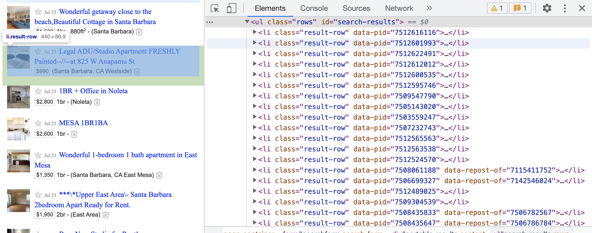

# Webscraping

This chaper will focus primarily on *one* type of webscraping which is obtaining data through extraction on a website. The other method is using an API, which we will not go into here. Henceforth, when I refer to "web scraping" in this document, I will be referring to the extraction methods.

## Background Knowledge - Brief HTML Lesson

First, webscraping requires knowledge of HTML which is a language for creating webpages. Luckily, you do not need to be an expert in HTML to be an effective scraper, but you *do* need to understand the coding structure of HTML which works in a nested structure. Before continuing on with this document, please watch [this 12 minute video](https://www.youtube.com/watch?v=bWPMSSsVdPk) on HTML. It will explain HTML far better than I can in a short amount of time. There are three main takeaways you should get from this video: the structure of an HTML document, what an [HTML element](https://www.w3schools.com/html/html_elements.asp) is, and what an [HTML attribute](https://www.w3schools.com/html/html_attributes.asp) is. 

To summarize the most important point of the video, HTML works with a nested environment structure—very similar to Latex. In particular, each environment is denoted by a *tag* (`<>`). Tags must be started with `<>` and ended with `</>`. As a quick example, consider the following html code:

```{r, eval = F}
<html>
  <head>
    <title> Page Title </title>
  </head>
  <body>
    <h1> First Header </h1>
    <p> You can add a paragraph here </p>
  </body>

</html>
```

The first tag denotes the start of an HTML document. All other tags are placed inside of this document. The ending `</html>` tag denotes the end of the document. Putting tags outside of this ending tag will result in your material not being presented on the HTML page. 

Now observe the `<head>` tag which creates the `<head>` environment. Note that everything from the start of the `<head>` tag to the end of the head tag (`</head>`) is also referred to as an *HTML element*. This will be helpful when remembering names of R functions that will be useful in webscraping. Within this environment, there is another tag named `<title>`. Inside of the `<title>`, there is text "Page Title" which is the page title. Notice that the title is concluded with the `</title>` ending tag and that this entire environment is hosted within the `<head>` environment. Any time a tag is hosted within another tag, we call this a *child*. Again, this will be helpful for when we begin using R's functions. 

Next, if you observe the `<body>` tag, you will see it has two *children*: `<h1>` and `<p>`. The video will explain these two tags, but it's mostly important to note that each of these tags have text in-between them and their tags also end with the `</>`. Be sure to watch the video to understand what an attribute is. 

By this point, you should at least be familiar with the nested structure of HTML documents, what an HTML element is, and what an HTML attribute is. Understanding this structure is crucial to effectively webscraping.

## Webscraping with `rvest`

The most frequented package for scraping websites in R is the `rvest` package. The `rvest` package is actually quite user friendly as there are only a few functions that are needed to successfully scrape most pages. What follows are the three most necessary (and sometimes sufficient) functions in `rvest`:

* `rvest::read_html` - reads an html. Uses link as argument.
* `rvest::html_elements` - takes in a CSS selector (more on this later) as argument and returns all elements with that selector. To be used after `read_html`
* `rvest::html_text2` - gives all text inside the element above. To be used after `html_elements`.

There are also a few other useful functions, although these will be used far less frequently:

* `rvest::html_children` - gives all "children" of the element selected. To be used after `html_elements`.
* `rvest::html_table` - specific function for gathering tables. 
* `rvest::html_attr` - gets a particular attribute from an element. Common attributes are "href", "img".

## Common Workflow.

A common workflow for the web scraping a page with `rvest` is to do the following steps:

1. Copy the URL. Read the page in with `rvest::read_html`.
2. While in Google Chrome (or another web browser) find the piece of data you want to scrape, right-click, then hit "inspect". This will bring up the raw HTML code that maps to the piece of data you want.
3. Find the HTML element associated with this piece of data. Using `rvest::`html_elements`, input the CSS selector associated with this HTML element.
4. Use `rvest::html_text2` to extract the text from the desired HTML element.
5. Convert into a data frame or tibble, and perform some `dplyr` functions to clean up.

Next, we will go through an example using Craigslist housing.

## Example: Craigslist

### Extracting the Descriptions

Our goal of this example will be to extract the page of housing listings from Craigslist. Some of the pieces of data wanted are: housing price, bedroom number, description, and corresponding link. I will go through each step of the common workflow outlined in the section above and will extract all of the listings descriptions in detail. In the next section, I will show how to extract the corresponding hyperlink as this process is slightly different. The other pieces will be left as an exercise to the reader as they are very similar in strategy. Note that housing listings are frequently updated, so the contents may appear different. However, this should not affect the general strategy.

**Step 1:** Copying the link and reading in the HTML.

```{r}
library(tidyverse)
library(rvest)

## copying the link and assigning a name
link <- "https://santabarbara.craigslist.org/search/apa"

## reading in the Craigslist housing listing
housing_page <- read_html(link)
```

**Step 2:** Within the browser, finding the desired information, right-clicking, and then clicking "Inspect". For this example, I will click the description of the first listing as shown in Figure \ref{pic}. Notice that part of the HTML code is highlighted—this shows where the information is in the HTML. 

```{r, fig.cap = "\\label{pic}The raw HTML code after clicking the Inspect button on the description of a Craigslist listing."}

```


**Step 3:** Now it is important to find the HTML elements associated with the information wanted. Recall that the listing description is wanted. It appears that the HTML element `<h3 class="result-heading">` contains the desired listing description in the text field. Notice that this also appears to be nested under the HTML element `<li class="result-row" data-pid=...>`. To extract these elements, the `rvest::html_elements` function will be necessary. But first, it is important to understand a small amount about CSS selectors so that the function arguments of `rvest::html_elements` are quick and simple.

### Brief Hiatus: CSS Selectors

In addition to HTML, CSS is another language you should have some familiarity with when web scraping. CSS stands for "Cascading Style Sheets". CSS describes how HTML elements are displayed on the screen, paper, or other media. CSS saves HTML coders a lot of time, as CSS can be applied to multiple webpages at once. CSS is integrated into HTML, so they appear in conjunction with each other. However, the most beneficial aspect of CSS to a web-scraper is that CSS can be applied to all HTML elements on a page. However, we can actually extract all HTML elements that have certain CSS properties attached to them with the use of *CSS selectors*. You can think of CSS selectors as relatively similar to regular expressions for CSS—they identify certain elements based on key identifiers. For the purposes of this lecture (and generally, in most cases), I will only focus on two selectors which are shown in the Table \ref{cssselectors} below:

```{r, echo = F, message = F, warning = F}
library(tidyverse)
library(rvest)
library(kableExtra)

html <- "https://www.w3schools.com/css/css_selectors.asp"
css_selectors <- read_html("https://www.w3schools.com/css/css_selectors.asp") %>% 
  html_table() %>% 
  pluck(1) %>% 
  slice(1:2) %>% 
  kbl(booktabs = T, caption = "\\label{cssselectors}Simple CSS Selectors")
  
```

```{r, echo = F}
css_selectors %>% 
  kable_styling(latex_options = "HOLD_position")
```

(End Hiatus)

**Step 3 Continued:** Now, I will tell R to place me into the nested structure of the HTML using the CSS selectors in conjunction with `rvest::html_elements`. As noted in the documentation, `rvest::html_elements` takes in CSS selectors as its argument. Hence, you will need to have some small level of comfort with writing CSS selectors (although I find it easiest to just use [this link](https://www.w3schools.com/css/css_selectors.asp) as a cheat sheet). Recall that the listing description is nested under the  we want is nested under the HTML element `<h3 class="result-heading">`. To select this element, we can use the CSS selector: `#.result-heading`. Observe:

```{r}
housing_page %>% 
  html_elements(".result-heading")
```

Realize that the `rvest::html_elements` function extracted every single HTML element that had the `class="result-heading"`. At this particular point in time (since the Craigslist page is likely to change), I have 120 nodes that reflect this. 

**Step 4/5:** I will now extract the text from these elements with the `rvest::html_text2` function and transfer this information to a tibble with some simple wrangling functions: 

```{r}
housing_page %>% 
  html_elements(".result-heading") %>% ## extracting each element with this particular class
  html_text2() %>% ## extracting the text from the elements
  as_tibble() %>% ## transforming to a tibble
  rename(description = value) ## renaming the column
```

We can now save this as a first column of a data frame to be bound together with the other desired information later:

```{r}
description_info <- housing_page %>% 
  html_elements(".result-heading") %>% ## extracting each element with this particular class
  html_text2() %>% ## extracting the text from the elements
  as_tibble() %>% ## transforming to a tibble
  rename(description = value) ## renaming the column
```

### Extracting the Hyperlinks

To extract the hyperlinks, I will use a similar strategy, although I will provide less details on the information already covered. Notice that the HTML element <li class = "result-heading"> contains a child `<a>` that has the HTML attribute "href" (look back at the video and corresponding links if you need to remember what these are). I will now go through the workflow:

```{r}
housing_page %>% 
  html_elements(".result-heading") %>% ## extracting each element with this particular class
  html_elements("a") %>% ## taking all elements a that are nested under class="result-heading"
  html_attr("href") %>% ## 
  as_tibble() %>% ## transforming to a tibble
  rename(hyperlink = value)  ## renaming
```

Notice that there are subtle differences in the strategy used here. First, using `html_elements(".result-heading") `, I extracted each HTML element that had with the `class = "result-heading" using the CSS selector. Next, I observed that `href` was an HTML attribute of the HTML element `a`. Hence, I used `html_elements("a")` to extract all of the `<a>` elements. Finally, I used `html_attr("href")` to extract all of the hyperlinks that were contained in the `<a>` element and then put all of this information into a tibble with an informative column name.

**IMPORTANT:** Because `html_elements("a")` comes after `html_elements(".result-heading")`, `rvest` only grabbed the `<a>` elements **that are nested underneath the elements that have the `class="result-heading"`**. This is a very important point and why you must understand the nested structure of HTMLs. If these functions were out of order, a substantially different result would be obtained (try it yourself). 

I will now save this tibble with the assigned name "hyperlink":
```{r}
hyperlink <- housing_page %>% 
  html_elements(".result-heading") %>% ## extracting each element with this particular class
  html_elements("a") %>% ## taking all elements a that are nested under class="result-heading"
  html_attr("href") %>% ## 
  as_tibble() %>% ## transforming to a tibble
  rename(hyperlink = value)  ## renaming
```

### Binding the Information Together

To bind together all of the columns, simply use `dplyr::bind_cols` to create the final tibble. Look out for when there are missing values that could cause dimension issues. If you would like to solve this issue, visit [here](https://community.rstudio.com/t/web-scraping-with-missing-values/95926/2).

```{r}
## binding together to form one tibble.
craigslist_listings <- bind_cols(description_info, hyperlink)
```


## Example: Wikipedia

For this example, I will be using the less frequented (but *very* time-saving) function `rvest::html_table`. This function simply extracts all tables that are found in an HTML file and automatically converts it to a tibble. If there is more than one table on the HTML page, then the function creates a list of tibbles. 

To demonstrate, I will use a Wikipedia page that contains lists of the best selling music albums of all time. 

```{r}
## album link
album_link <- "https://en.wikipedia.org/wiki/List_of_best-selling_albums"

## reading in 
wiki_page <- read_html(album_link)
```

Now, I will simply use the `rvest::html_table` function. As mentioned, since there are many lists on this page, the function will return a list of tibbles in the order of occurrence on the page (top to bottom). For clarity on this document, I will use the `purrr::pluck` function to extract only the 2nd entry of this list which will map to any album that sold over 40 million or more:

```{r}
wiki_page %>% 
  html_table() %>% 
  pluck(2)
```

Notice how simple this was: there was no need to find the HTML structure or elements!

